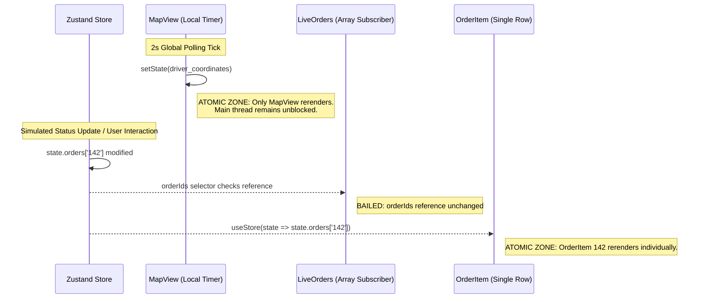
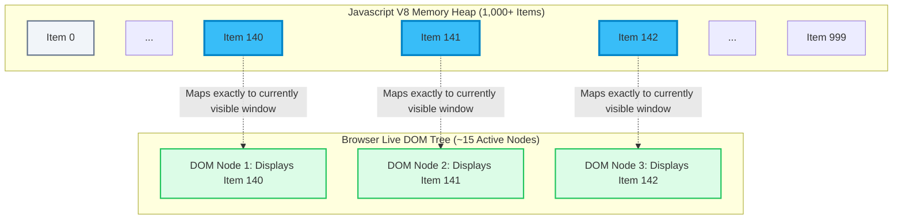
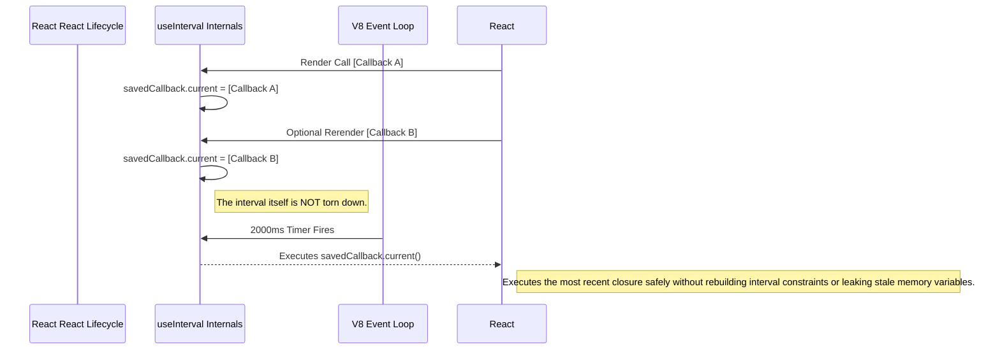

# Logistics Dashboard: Performance & Memory Architecture Specification

**Scope**: Memory efficiency, render-optimization, DOM virtualization, reference stability, and garbage collection mechanisms for the Real-Time Logistics Dashboard.

## 1. Goal & Architectural Philosophy

The objective of the Logistics Dashboard is to sustain lag-free, uninterrupted 60 FPS performance while natively managing 1,000+ localized data points (Delivery Orders) occurring alongside a high-frequency polling environment (2-second global driver coordinate updates).

This specification outlines the systematic measures chosen to guarantee atomic render cycles and completely avert main-thread blocking, layout thrashing, and memory leaks.

---

## 2. State Management Architecture: Normalized State vs. Flat Arrays

### The React Context Re-render Waterfall (The "Flat Array" Problem)

If we stored the orders inside a Flat Array natively managed by a typical React `Context`, any update to a singular order object requires modifying the generic array structure immutablely. 

**Is it because we have to update the whole array?**
Yes. In React, state must be treated implicitly as immutable data. You cannot simply modify an object in place (`orders[5].status = 'Delivered'`). You must create a completely **new array reference** using mapping:

```javascript
// The immutable array update forcing a new reference
setOrders(prev => prev.map(order => 
  order.id === targetId ? { ...order, status: 'Delivered' } : order
))
```

Because the entire array reference effectively changes in hardware memory, the `<OrderContext.Provider value={orders}>` sees a brand new object. 

**The Execution Sequence leading to a Rerender Cascade:**
1. **Event Trigger:** A single driver updates their status from *Pending* to *Delivered*.
2. **Immutability Requirement:** The global Context state creates a completely new array (`[...newOrders]`) to reflect this single change.
3. **Context Notification:** The React `Context.Provider` detects its `value` prop has a new identity.
4. **Mass Invalidation:** Every single `<OrderItem />` component subscribing to `useContext()` to read its data is forcefully invalidated, because from React's perspective, the "data pool" they rely on has shifted.
5. **The Bottleneck:** React is forced to execute the reconciliation algorithm (the Render phase) for **all 1,000+ items** simultaneously, deeply checking if the DOM needs updating for items that never actually changed.

To explicitly bypass React's standard context propagation cascades, we employ **Zustand** utilizing a **Normalized State Dictionary**.

### The Normalized State Tree Model

```mermaid
graph TD
  subgraph Anti-Pattern: Flat Array
    StateArr[Global State] --> Arr[Array]
    Arr --> O1_F[{id: 1, status: Pending}]
    Arr --> O2_F[{id: 2, status: Preparing}]
    Arr --> O3_F[{id: 3, status: Delivered}]
  
    style StateArr fill:#fee2e2,stroke:#b91c1c,stroke-width:2px
    style Arr fill:#fca5a5,stroke:#b91c1c,stroke-width:2px
  end

  subgraph Architecture: Normalized Dictionary
    StateDict[Global State] --> Dict[orders: Record<string, Order>]
    StateDict --> ArrIds[orderIds: Array<string>]
    Dict --> O1_N[1: {id: 1, status: Pending}]
    Dict --> O2_N[2: {id: 2, status: Preparing}]
    Dict --> O3_N[3: {id: 3, status: Delivered}]
  
    style StateDict fill:#dcfce7,stroke:#15803d,stroke-width:2px
    style Dict fill:#86efac,stroke:#15803d,stroke-width:2px
    style ArrIds fill:#86efac,stroke:#15803d,stroke-width:2px
  end
```

By maintaining an unchanging `orderIds` array, the parent container (`LiveOrders`) remains referentially stable. Individual order updates only recreate the specific target key within the `orders` dictionary, allowing $O(1)$ lookup and **atomic reactivity**.

---

## 3. Render Optimization: Atomic Update Cycles

High-frequency operations, like a 2-second location polling loop, natively trigger React rendering lifecycles. If misaligned conceptually, this polling triggers global reconciliation.

We partition our render boundaries explicitly. The `MapView` component owns and sequesters its own polling loop.

### Component Render Cycle



---

## 4. DOM Virtualization (react-window)

Even with optimized $O(1)$ state propagation, committing 1,000 DOM nodes simultaneously guarantees layout thrashing, excessive scripting time, and layout repaints because standard DOM manipulations are inherently expensive operations.

By implementing `react-window`, we completely sever the link between what is in memory vs. what acts as a DOM node.

### DOM Virtualization Memory Model



By passing a primitive string `id` to the memoized `OrderItem`, React simply patches the visible nodes via CSS `transform: translateY()`.

**Performance Savings**:

- Cuts Node Allocation by ~98% (from 1000 nodes down to ~15 nodes).
- Retains memory footprint extremely low (under a megabyte for standard mock objects).

---

## 5. Reference Stability (Fiber Tree Preservation)

React will unilaterally flush a component if primitive references change. Wrapping an element in `React.memo` is futile without strict reference tracking.

```tsx
const OrderItem = React.memo(({ id, style }: OrderItemProps) => { ... })
```

Inside our Row definition, we enforce reference stability by utilizing `useCallback` on internal handlers mapped directly against dependencies like `id`.

```tsx
const handleAdvanceStatus = useCallback(() => {
  if (!order) return;
  const nextStatus = nextStatusMap[order.status];
  if (nextStatus) {
    updateOrderStatus(id, nextStatus);
  }
}, [id, order, updateOrderStatus]);
```

**Why it matters:**
During scrolling or localized updates, React evaluates `OrderItem` reconciliation. With `useCallback`, handlers passed dynamically to internal nodes (`<button onClick={...}>`) will consistently match preceding renders. This effectively instructs the Fiber Tree to completely abort deep render checks, directly bypassing the rendering pipeline for untouched entries.

---

## 6. Garbage Collection, Timers & Memory Leaks

Using React's standard `useEffect` paired directly with native browser `setInterval` causes extreme closure staleness and forces continuous mounting/teardown mechanics dynamically—leading to detached DOM memory leaks if timers fire exactly when sub-components unmount.

We engineered a **declarative `useInterval`** hook that guarantees reference tracking through `useRef` mutable references.

### useInterval Event Loop Pipeline



By anchoring the closure logically in a mutable ref (`savedCallback.current`), we continuously swap the latest function definition inherently maintaining current variable scope without actively re-binding the native V8 `setInterval` ID. This is inherently crash-proof during concurrent React environment navigation.

---

*This document serves as the foundational architectural specification for expanding any high-throughput views moving forward in the Logistics Dashboard scaling lifecycle.*
